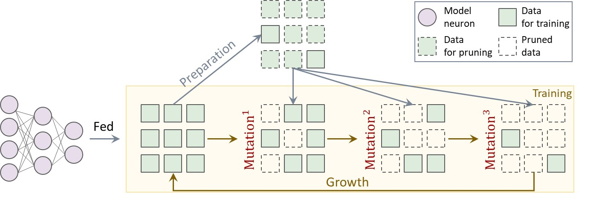

# SCAN: Bootstrapping Contrastive Pre-training for Data Efficiency

[](https://arxiv.org/abs/)

#### Detailed configuration of each model can be found in each model directory.

<div style="text-align:center">
  
</div>


### Acknowledgement
If you found this repo helpful, please consider cite the following paper:
```bibtex
@misc{scan,
      title={SCAN: Bootstrapping Contrastive Pre-training for Data Efficiency}, 
      author={Yangyang Guo and Mohan Kankanhalli},
      year={2024},
      eprint={2411.09126},
      archivePrefix={arXiv}
}
```
